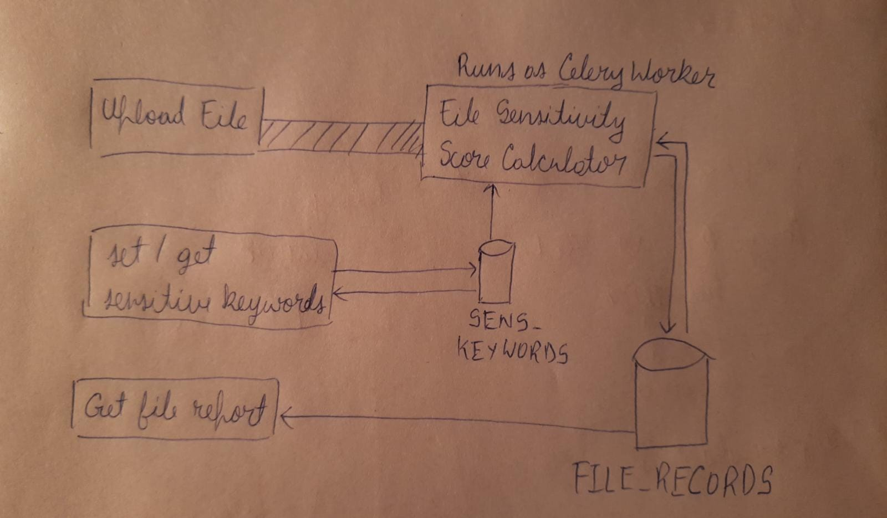

## Startup guide

1. Prerequisite: Have docker installed on your system
2. Open the file directory on your terminal and run `docker compose up`

## Unit testing

1. Install all requirements from requirements.txt
2. Run `python manage.py test` on the terminal 

Do note that the test coverage is limited to the celery task and the Container class for MongoDB methods.

## Tech stack

1. Django
2. MongoDB
3. Celery
4. RabbitMQ
4. Docker

## Project overview  

### Architecture overview  

### Database schema

- FILE_RECORDS_COLLECTION  

    {  
        "file_name": stores the name of the file,  
        "user": user who uploaded the file,  
        "sensitivity_score": sensitivity score of the file,  
        "sensitivity_level": sensitivity score of the level,  
        "sharing_status": indicates whther the file was shared successfully,  
        "file_uploaded_at": stores the date-time of when the file was processed
    }  

    Note that the file_uploaded_at attribute is essential in cases where the sensitive-kywords might have been updated after the file was processed; as such the user might decide to re-upload the file to get an up-to-date record.    
      
  
- SENS_KEYWORDS_COLLECTION  
Maintained such that always only contains a single document which maps keywords to their respective sensitivity scores.   

### Endpoints and their functions

- /upload_file/  
The user provides a username and uploads a file. The endpoint handles saving the file on the server, and calls the Celery task with the username and file_name.  
- /get_report/?user=u1&file=test.txt  
Downloads the report for the specified user and file as a .txt file. The report includes other information like total number of files on the system, numner of high/medium/low sensitivity files, etc  
- /keywords   
The user can specify the keywords to be used by the system. 
- /keywords/get  
The user can see the keywords and their respective scores currently set on the system

### The celery task

- Accepts a username and file_name as arguments
- Retrieves the sensitive keywords from the database. This has to be done whenever the keywords have been updated by the user. 
- Open the file_name specified. To achieve this, the /upload_file/ endpoint stores every user's files in a separate directory. 
- Go through the file's contents to look for sensitive keywords, and count their occurences. Then create a report and push the report to the FILE_RECORDS_COLLECTION.

### Using MongoDB
- MongoDB allows for fast and easy development as little to none setup is required to start pushing documents to a collection. The flexibility of not being bound to a schema is also quite helpful in the early stages of development. And if needed, the database can be switched to any other database easily since in this project I've used the database through a container class.

## Performance Optimizations
- Using indexing with MongoDB  
Indexes are special data structures that stores some information related to the documents such that it becomes easy for MongoDB to find the right data file. The indexes are order by the value of the field specified in the index.    
In this project I'm using an index set on the sensitivity_score attribute to efficiently retrieve the top 10 most sensitive files in the system.

## Limitations and possible improvements
  
1. Extracting all occurences of keywords from file contents is an expensive task and should be parallelized. This can be done by deploying more celery workers and distributing the file contents between the workers.

